---
sidebar:
    - /guide/
    - /guide/ali-cloud-simple/
    - /guide/ali-cloud/
    - /guide/tx-cloud/
    - /guide/docker/
    - /guide/qinglong/
    - /guide/location/
---

# 阿里云计算部署-零基础教程

::: warning 注意
此方法不免费，经过测试，执行一次大概 0.02 元，一个月 30 次就是 0.6 元，但是适合 0 基础小白、没有服务器的小伙伴。
建议提前充好几块钱，不然欠费的会被直接删除函数。
:::

## 注册并开通功能

访问[阿里云](https://www.aliyun.com/)官网，注册后完成实名认证，并开通云函数、SLS 功能。

### 实名认证

`账号中心/实名认证` [链接](https://account.console.aliyun.com/v2/#/authc/home)。

### 云函数功能

首先进入[云函数功能首页](https://fcnext.console.aliyun.com/overview)，系统将提示开通功能。

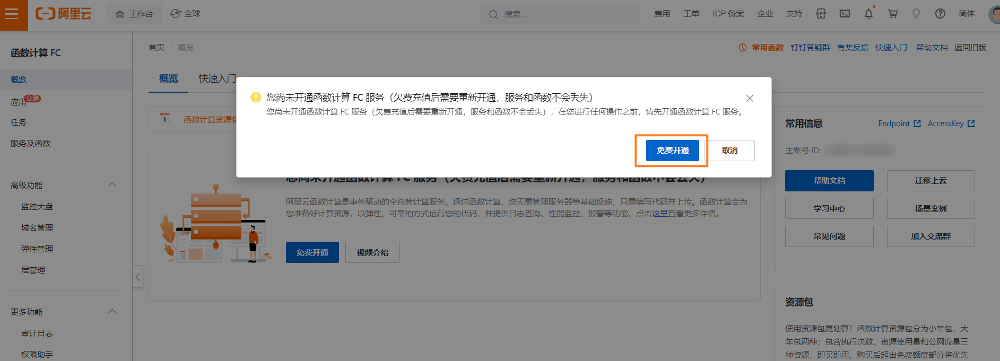

### 开通 SLS 日志服务

访问 SLS 功能[主页](https://sls.console.aliyun.com/lognext/open)，开通日志服务SLS。

## 获取 Github 授权并 Fork 仓库

### 授权 Github 账号

云函数开通完成后，从主页进入`应用/通过仓库导入应用`，按照下图配置应用。

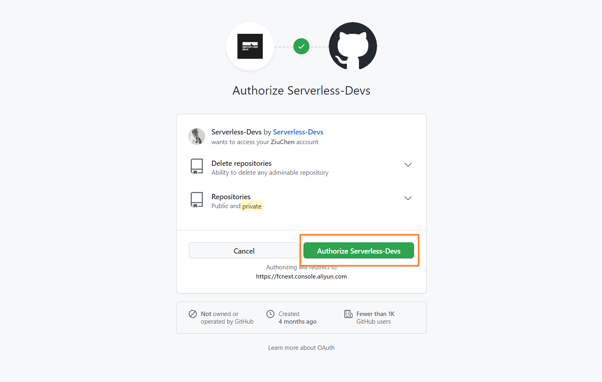

### Fork 代码仓库

使用授权的账号登录 GitHub，并访问仓库[XiaoMiku01/fansMedalHelper](https://github.com/XiaoMiku01/fansMedalHelper)，然后点击 Fork。

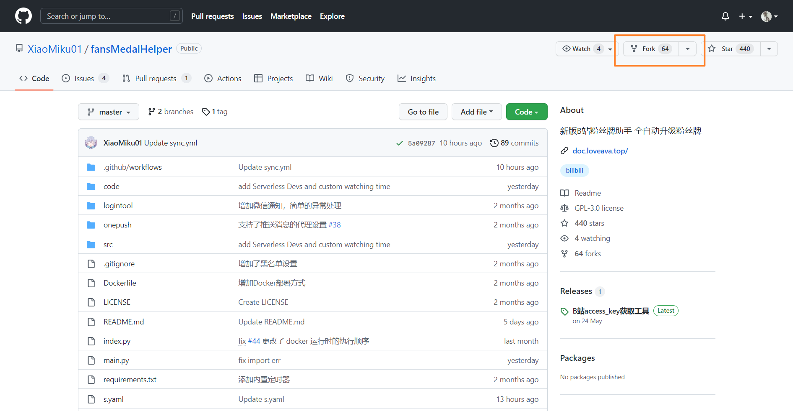  

## 获取账号配置  

进入本文档的小工具-[配置文件生成器](../tools/userConfigGenerator)页面，填写完成后，点击生成JSON到剪切板。
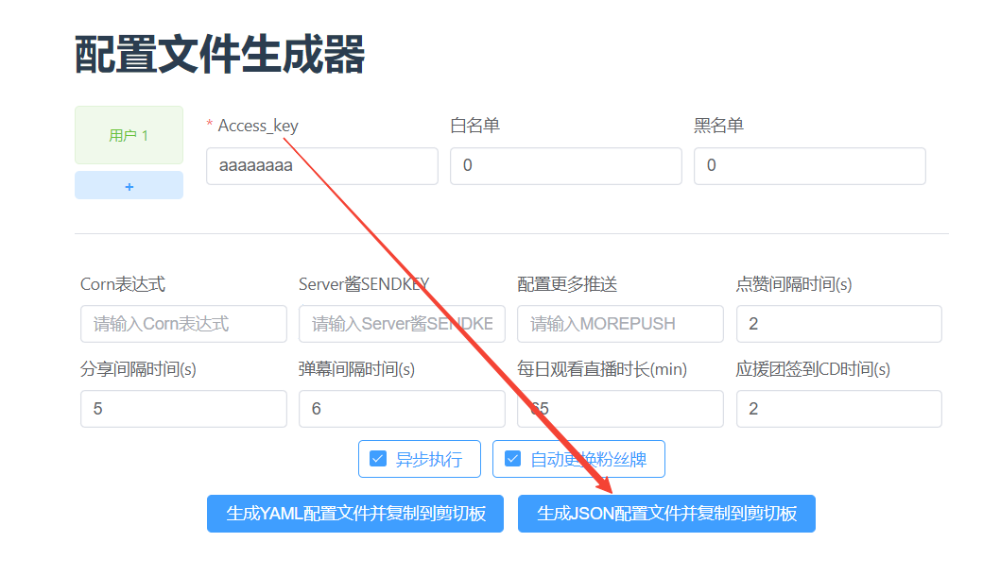  

::: tip 提示
配置文件说明 ：[配置文件](./#配置文件说明-users-yaml)  
由于是云函数触发，配置文件中的 `CRON` 无需填写。
:::

## 配置应用

回到云函数的应用配置界面，继续按下图配置应用。

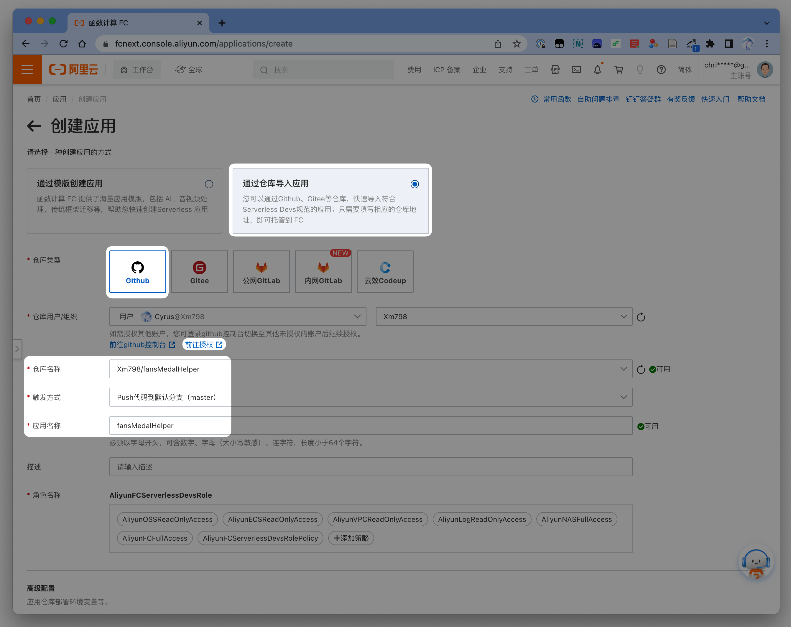

* 仓库名称: `fansMedalHelper`
* 角色名称: 按提示创建
* 点击：高级配置 - 流水线配置方案 - 高级配置 - 环境变量
* 选择`使用表单编辑`，创建一个`USERS`变量，**全为大写** 值填写刚刚剪切板的内容

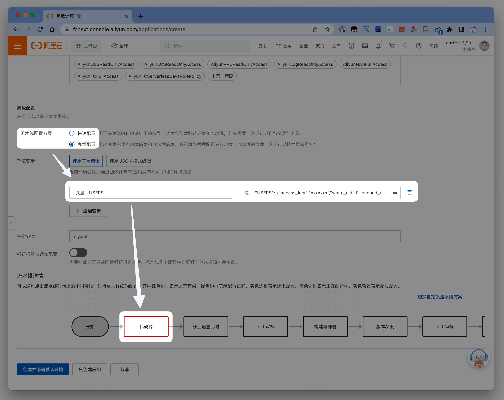

点击最下方**流水线详情**中的**代码源**方块，触发方式选择 **Push 到指定分支触发**，下方分支选择 **master**。

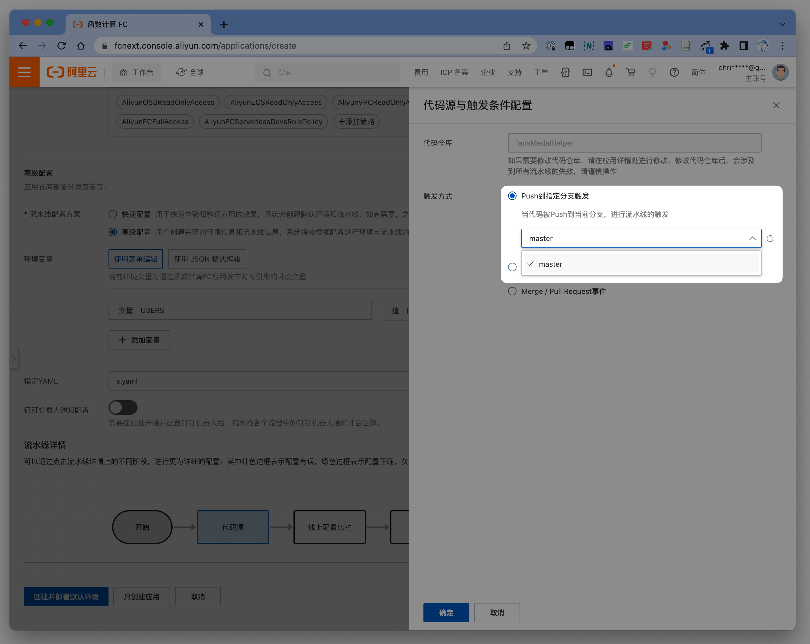

::: warning 注意
  老用户配置文件中的`WATCHINGLIVE`值为 1 新版本已经更改为 65。
  
  如果`仓库名称`中未出现`fansMedalHelper`，可以点击右侧刷新按钮重新获取仓库列表。
:::

## 创建应用

配置完毕后，点击下方`创建`创建应用。

耐心等待初始化、部署等操作完成后，提示部署成功即可。

### 测试函数

完成创建并部署成功后，点击**默认环境** - **函数名**，进入函数配置界面。

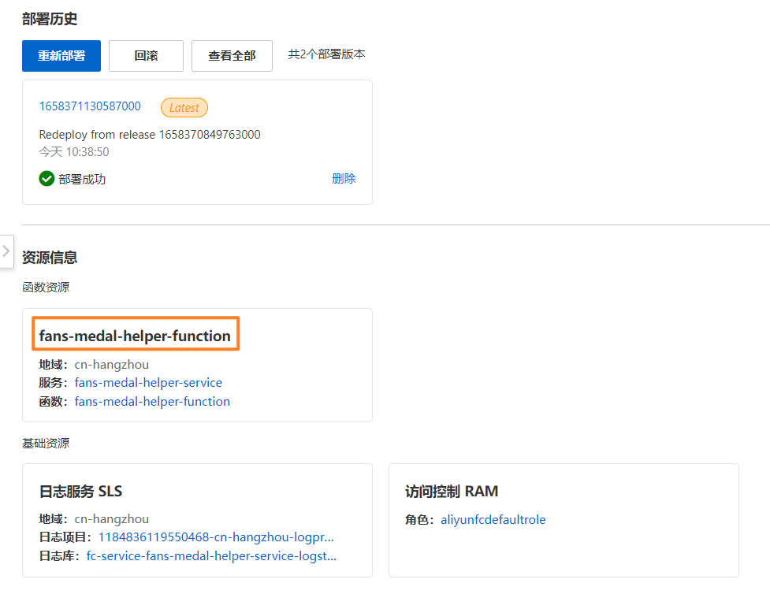

启动测试，到`调用日志/函数日志`，若能看到日志输出，证明已经测试通过。

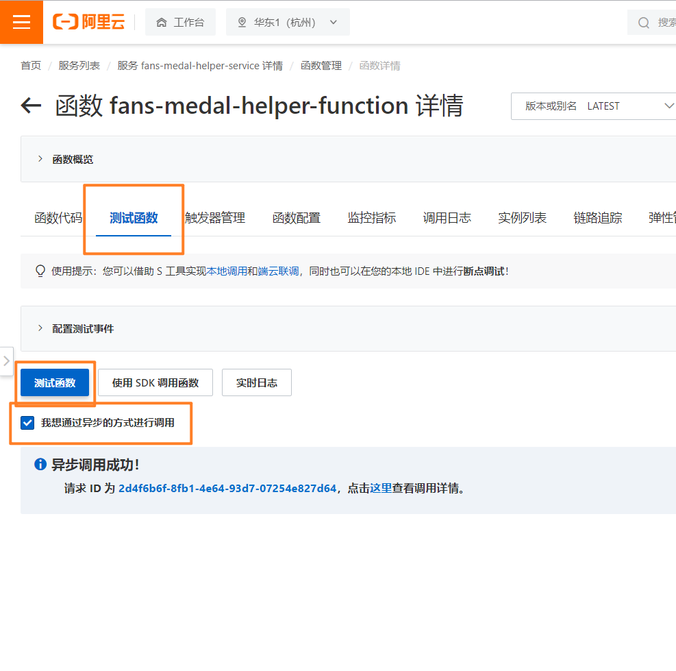

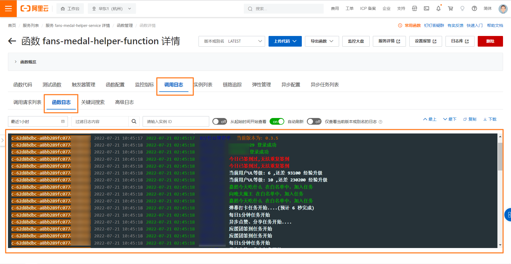

### 配置触发器

项目默认每天 00:01 运行一次，如需更改，可以在`触发器管理`中配置触发器。

## 开启自动更新（可选）

::: tip 提示  
开启自动更新后，项目有更新时都会自动部署。
:::

进入自己 Github 账户 刚刚 fork 的仓库，按下图操作。
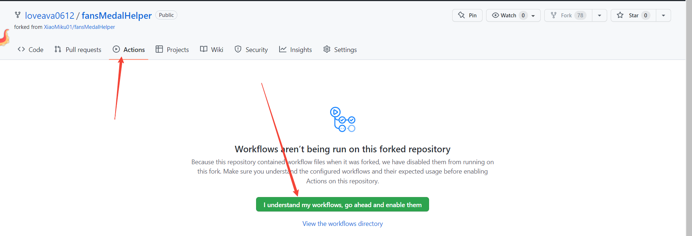
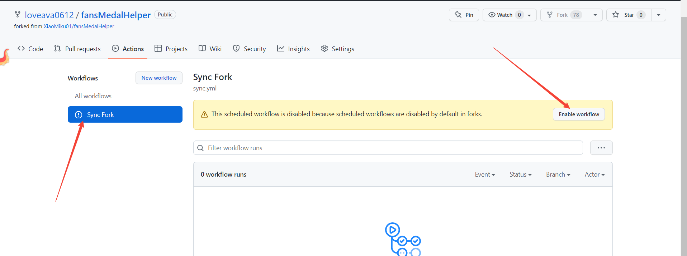

::: warning 注意  
开启后，Github 每个小时都会拉取一次最新代码，自动同步至阿里云。
:::

如果需要更新配置（如：账号登录过期），还需去阿里云更新配置，操作步骤如下：

进入刚刚创建的应用配置界面，编辑环境变量后，点击重新部署。

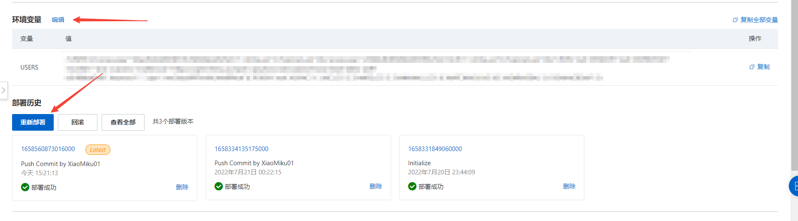

