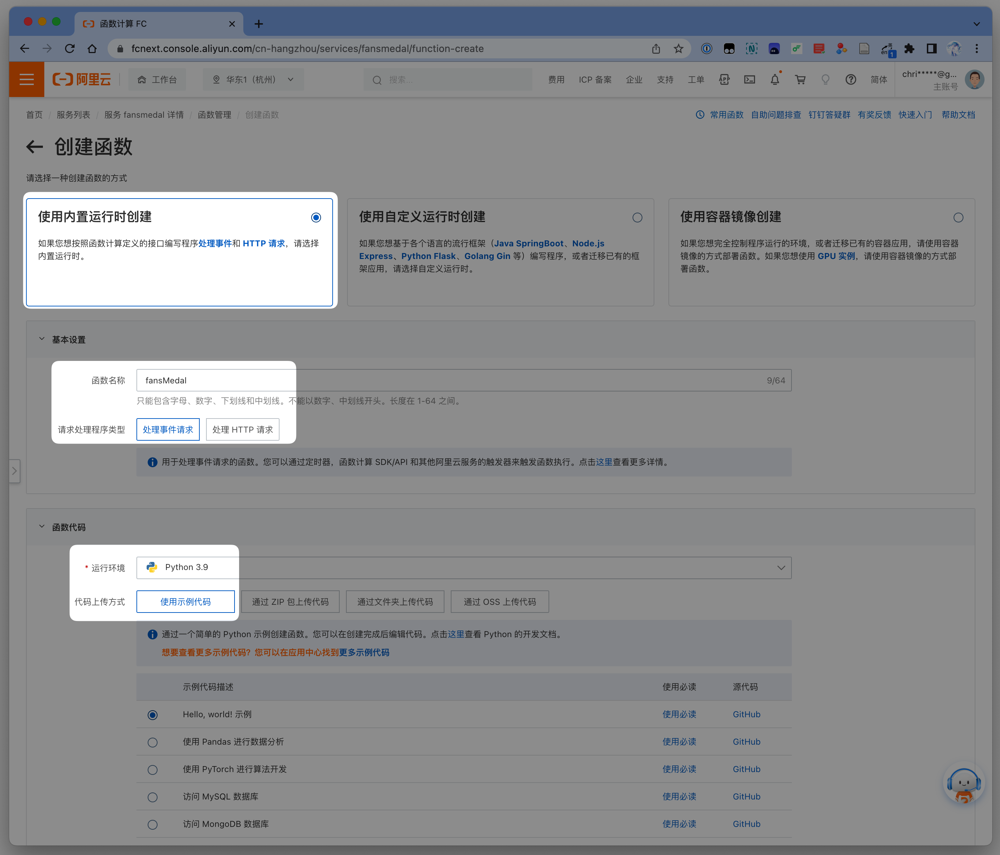
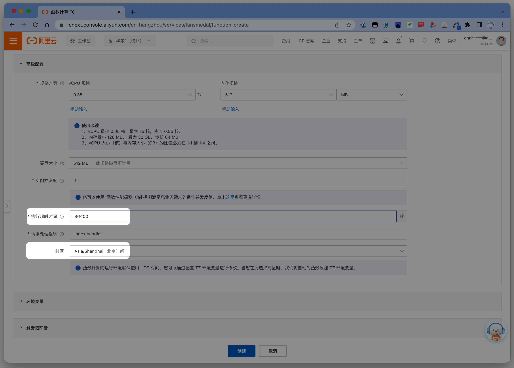
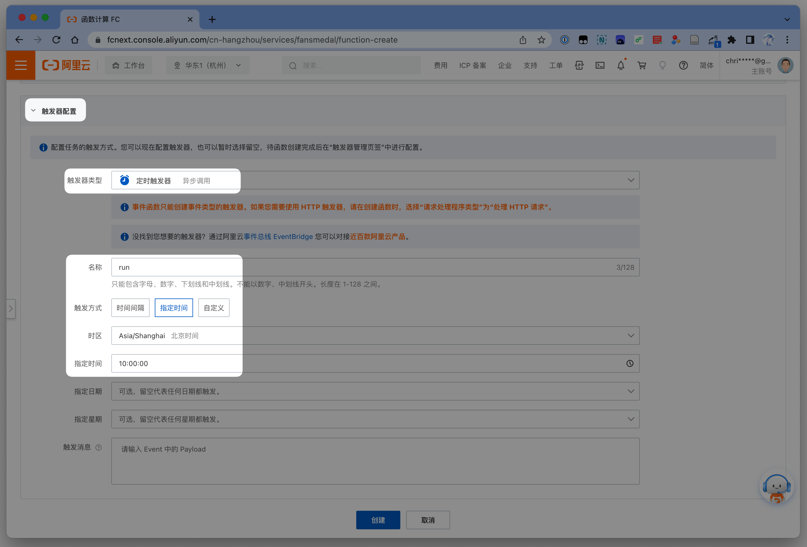
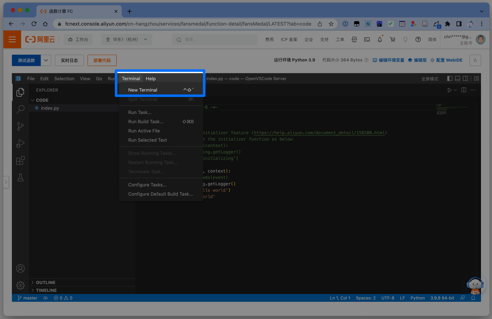
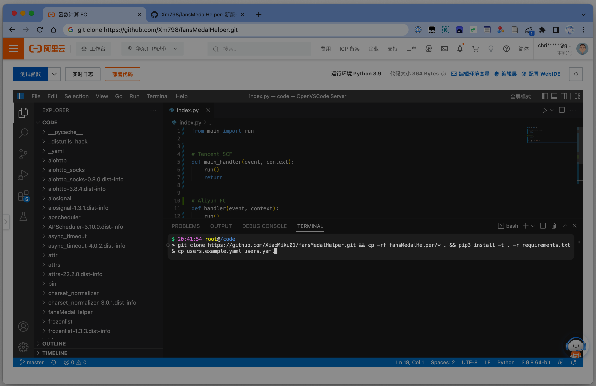
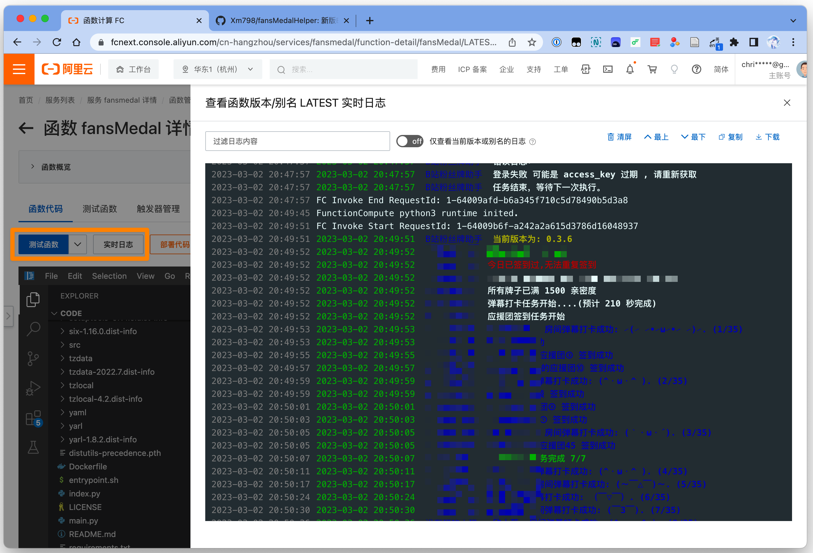

---
sidebar:
    - /guide/
    - /guide/ali-cloud-simple/
    - /guide/ali-cloud/
    - /guide/tx-cloud/
    - /guide/docker/
    - /guide/qinglong/
    - /guide/location/
---

# 阿里云计算（函数）部署

::: warning 注意
此方法不免费，经过测试，执行一次大概 0.02 元，一个月 30 次就是 0.6 元，但是适合 0 基础小白、没有服务器的小伙伴。
建议提前充好几块钱，不然欠费的会被直接删除函数。
:::

## 登录阿里云计算

官网：[函数计算 FC (aliyun.com)](https://fcnext.console.aliyun.com/overview)

-   登录后点击左侧 **服务及函数**

    

-   点击 **创建服务**

    

-   名称描述随便填，**确定**

    

-   进入后点击**创建函数**

    

## 配置函数

- 选择 **使用内置运行时创建**，**处理事件请求**，函数名随便，运行环境选择 **Python3.9**， 使用示例代码，如图：
    

- 下翻页面，展开 **高级配置**，**执行超时时间** 修改为 `86400`，**时区**选择 `Asia/Shanghai`。
    

- 展开 **触发器配置**，类型选择 **定时触发器**，名称随便填，触发方式选择 **指定时间**，指定时间填你想脚本每天开始执行的时间，下面的不用填，点击 **创建**。
    

## 下载脚本源码，并配置用户信息

- 在 **函数代码** 页面，点击编辑器菜单栏中的 `Terminal` - `New Terminal`（终端 - 新终端）。
    

- 在下方 **Terminal（终端）** 中输入或粘贴以下代码：
    ```shell
    git clone https://github.com/XiaoMiku01/fansMedalHelper.git && cp -rf fansMedalHelper/* . && pip3 install -t . -r requirements.txt && cp users.example.yaml users.yaml
    ```
    

    ::: warning 注意
    如果出现：
    fatal: unable to access 'https://github.com/XiaoMiku01/fansMedalHelper.git/': OpenSSL SSL_read: Connection was aborted, errno 10053  
    说明网络原因拉取失败，请重试几次。
    :::

- `回车` 运行完毕后，左边文件往下翻，找到 `users.yaml` 文件，填写你的配置信息，填写完毕后按 `Ctrl + S` 保存文件，之后点击左上方 **部署代码**。

    ::: tip 提示
    配置文件说明 ：[配置文件](./#配置文件说明-users-yaml)  
    :::

## 测试运行，查看日志

部署完毕后，点击左上角 **测试函数** ，之后点击 **实时日志**，查看右边日志是否运行正常或者报错，耐心等待运行结束。



## 完毕

设置，测试，运行没有问题后，就可以关闭页面了，之后每天都会在你设置的触发器时间到后自动执行。如果你还设置了微信推送，运行完毕后会收到通知。

## 云函数更新方法

回到 **函数代码** 页面，在页面下方 **终端**中按顺序输入或粘贴以下代码。

:::warning
注意你的所使用的云函数！腾讯云函数与阿里云函数的更新方法并不相同！
:::

第一步：在页面下方 **终端**中输入/粘贴以下内容，然后按下回车。

```shell
cd fansMedalHelper
```

第二步：再次在页面下方 **终端**中输入/粘贴以下内容：

```shell
git pull && cp -r * .. && cd ..
```

回车确定后，保存部署即可。如果提示 fatal，重复执行第二步。
