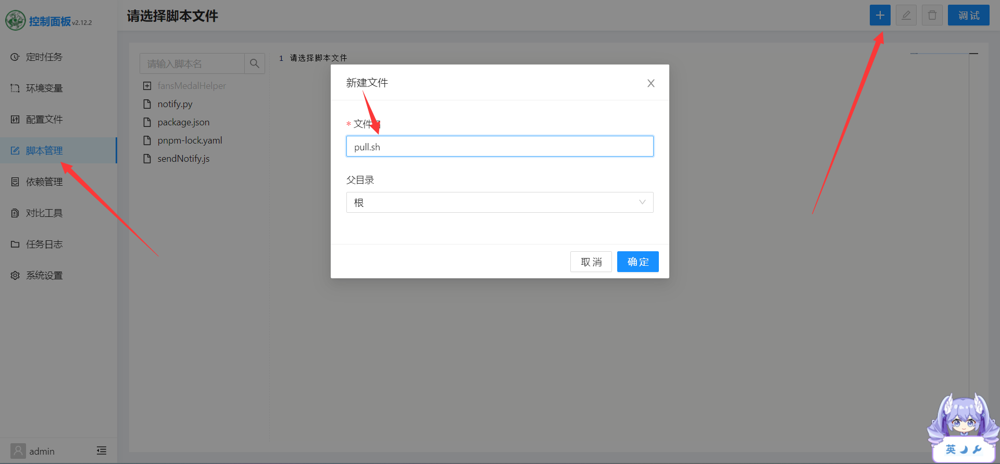
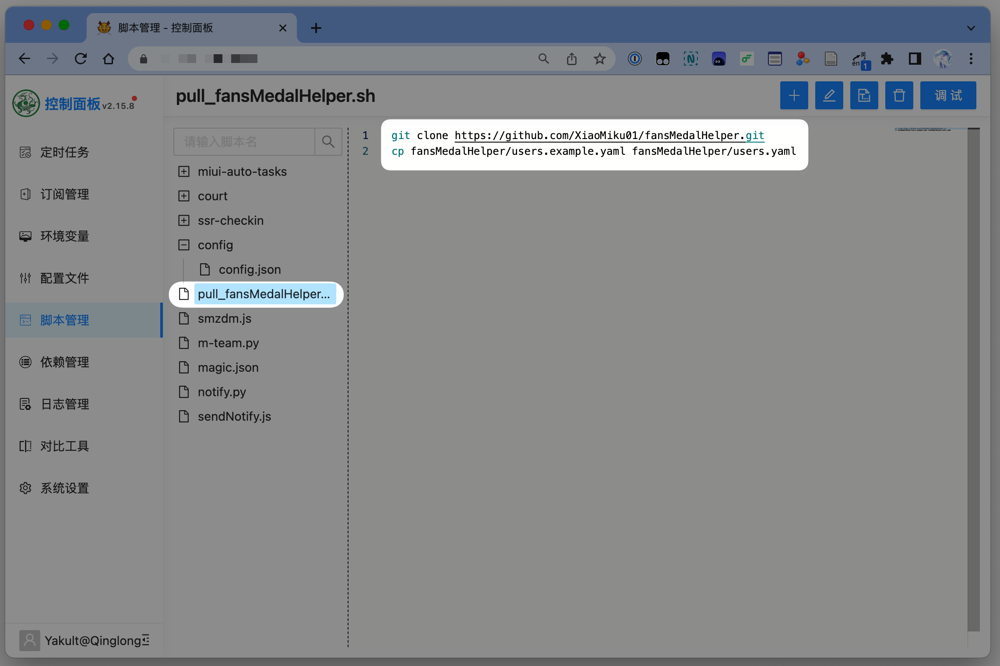
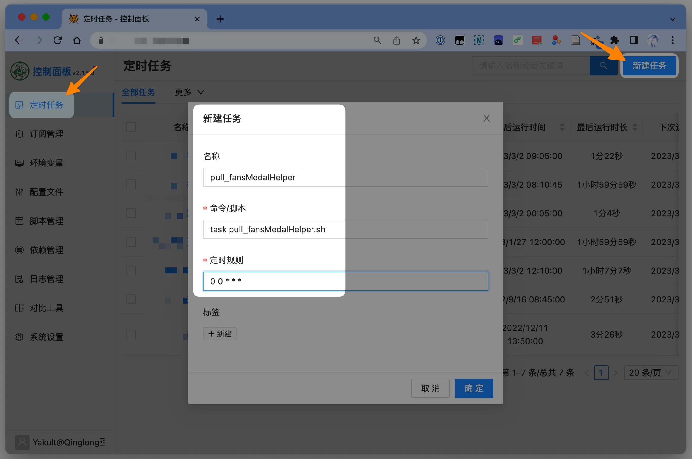
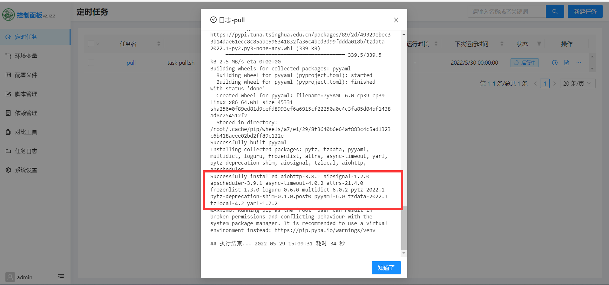
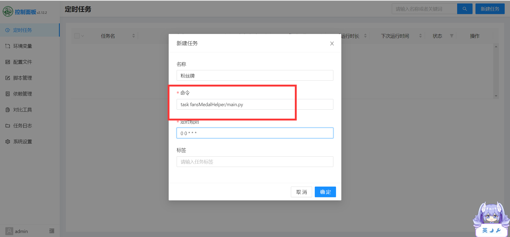

---
sidebar:
    - /guide/
    - /guide/location/
    - /guide/ali-cloud/
    - /guide/tx-cloud/
    - /guide/other/
---

# 其他部署方式

::: warning 注意
没什么好注意的，单纯为了格式一样好看点
:::

## 青龙面板部署

-   进入面板，左侧脚本管理，点击右上角加号，选择“新建文件”，填写脚本名称 `pull.sh`，点击“保存”
    
-   输入以下三行内容，点击“保存”
    ```shell
    python3 -m pip install --upgrade pip -i https://pypi.tuna.tsinghua.edu.cn/simple
    git clone https://github.com/XiaoMiku01/fansMedalHelper.git
    pip3 install -r fansMedalHelper/requirements.txt -i https://pypi.tuna.tsinghua.edu.cn/simple
    ```
    
-   面板左侧定时任务，然后新建任务，名称随便填，命令填 `task pull.sh`, 定时规则随便填，因为这个任务只要执行一次，确定  
    

-   点击右侧运行，打开日志，等待处出现 Successfully，说明依赖安装成功，之后就可以禁用或者删除这个脚本了
    

-   回到脚本管理，找到 `fansMedalHelper/users.yaml` 文件，编辑填写自己的配置，点击“保存”
    
    ::: tip 提示
    配置文件说明 ：[配置文件](./#配置文件说明)  
    由于是面饭触发，配置文件中的 `CRON` 无需填写  
    B 站 `access_key` 获取工具：[Release B 站 access_key 获取工具 · XiaoMiku01/fansMedalHelper (github.com)](https://github.com/XiaoMiku01/fansMedalHelper/releases/tag/logintool)
    :::
-   保存后新建定时任务，名称随便填，命令填 `task fansMedalHelper/main.py`, 定时规则填每天执行的时间，确定
    

-   部署完毕，点击运行测试，查看日志是否正常  
    ::: tip 提示
    日志中可能出现乱码，是正常现象，因为是输出的日志无法显示文字颜色
    :::

-   如何更新  
    新建一个名为 `updata.sh` 的脚本，内容为：
    ```shell
    rm -rf fansMedalHelper
    git clone https://github.com/XiaoMiku01/fansMedalHelper.git
    ```
    之后创建任务执行这个脚本，命令填 `task updata.sh`。运行完成后就更新成功
    ::: warning 警告
    更新后会重置用户配置，请在更新前备份好配置文件，然后重新配置

## Docker 部署

待更新
