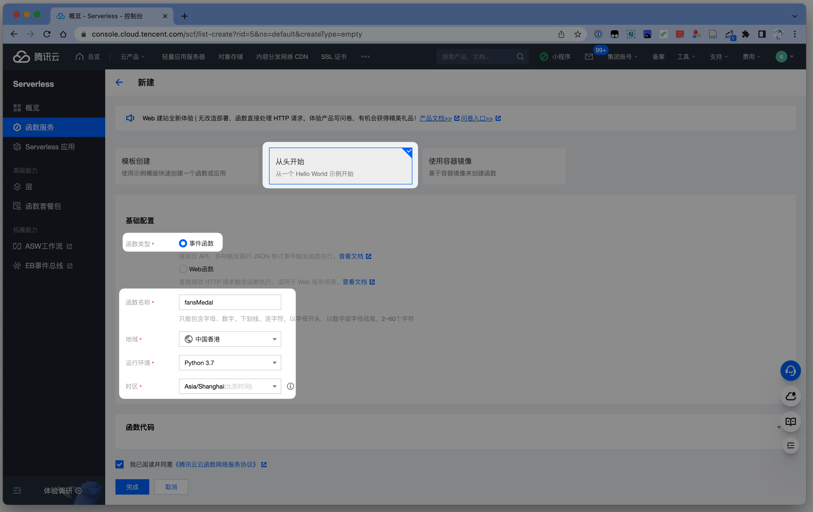
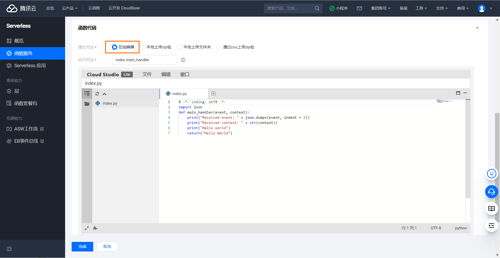
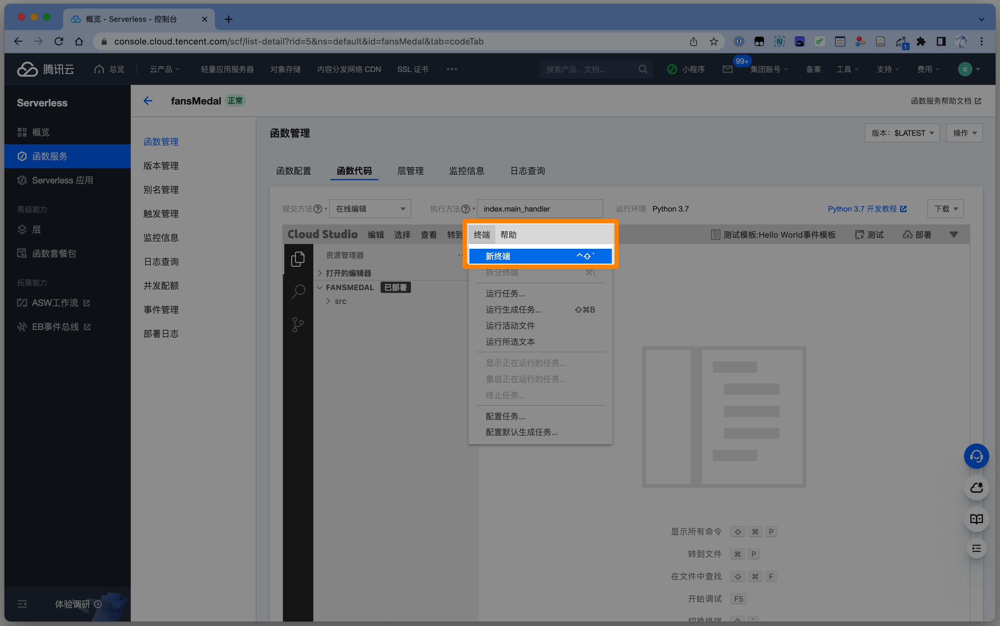
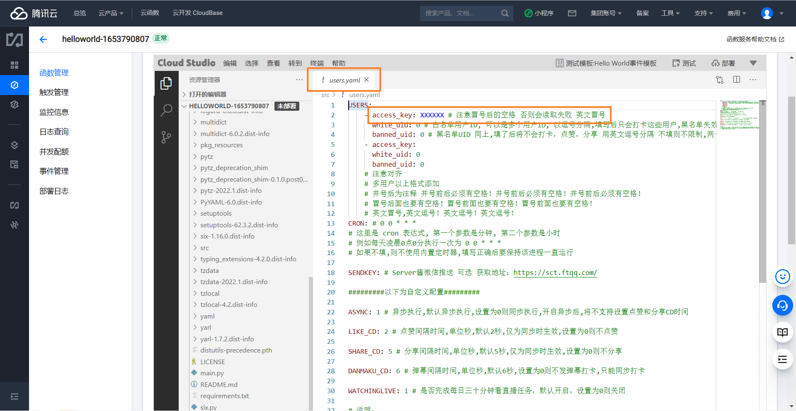

---
sidebar:
    - /guide/
    - /guide/location/
    - /guide/ali-cloud-simple/
    - /guide/ali-cloud/
    - /guide/tx-cloud/
    - /guide/other/
---

# 腾讯云函数部署

::: warning 注意
在首次开通腾讯云 SCF 功能的**前三个月可以免费使用**，之后每个月收取*12.8 元*。

学生认证后，可以申请*3.24 元 3 年*的套餐包。具体规则详见[官方宣传页](https://cloud.tencent.com/act/campus)。
:::

## 创建函数并初始化

官网：[腾讯云函数 (SCF)](https://console.cloud.tencent.com/scf/list)

-   登录后点击左侧 **函数服务**，点击 **新建** 按钮

    

-   选择 **从头开始**，函数类型选择 **事件函数**，函数名称随意，地域保持默认，运行环境选择 **Python 3.7**

​ 

-   函数代码选择 **在线编辑**，其余内容保持默认（后续会修改）

​ 

-   高级配置中，首先勾选执行配置中的 **异步执行**（重要！）

​ 

-   随后向上翻页，将执行超时时间设为 **86400**（重要！）

​ 

-   （可选）设置触发器，设置为每日 0 时执行一次

​ 

全部配置完成后，点击最下方按钮 **完成** 并等待函数创建完毕。

## 导入代码并安装依赖

-   函数创建完毕后，切换到 **函数代码** 标签页，将执行方法修改为 `main.run`，随后依次点击编辑器中的 **终端**，**新终端**

​ 

-   在编辑器下部弹出的 **终端** 中，分次输入或粘贴以下代码并按下 **回车**：

    ```shell
    rm -rf src/index.py  &&  cd src
    ```

    ```shell
    git clone https://github.com/XiaoMiku01/fansMedalHelper.git && cp -r fansMedalHelper/* . && python3 -m pip install --upgrade pip && pip3 install -t . -r requirements.txt
    ```

    ::: warning 注意
    如果出现：
    fatal: unable to access 'https://github.com/XiaoMiku01/fansMedalHelper.git/': OpenSSL SSL_read: Connection was aborted, errno 10053  
    说明网络原因拉取失败，请重试第二步几次
    :::

    待终端日志不再更新，则代码与依赖都已导入完毕。

## 部署与测试

-   进入 `src/users.yaml` 修改用户配置，修改完毕并保存后，点击下方的 **部署**

​ 

::: tip 提示
配置文件说明 ：[配置文件](./#配置文件说明-users-yaml)  
由于是云函数触发，配置文件中的 `CRON` 无需填写  
B 站 `access_key` 获取工具：[Release B 站 access_key 获取工具 · XiaoMiku01/fansMedalHelper (github.com)](https://github.com/XiaoMiku01/fansMedalHelper/releases/tag/logintool)
:::

-   部署成功后，点击**测试**，在下方控制台可查看日志输出，耐心等待运行完毕即可

## 完毕

设置，测试，运行没有问题后，就可以关闭页面了，之后每天都会在你设置的触发器时间到后自动执行，如果你还设置了微信推送，运行完毕后会收到通知

## 云函数更新方法

-   回到 **函数代码** 页面，在页面下方 **终端**中按顺序输入或粘贴以下代码, 注意！更新前记得保存一下已有的`users.yaml`的文件内容，因为更新会重置配置文件：
-   (注意你的所使用的云函数！腾讯云函数与阿里云函数的更新方法并不相同！)
    
    第一步：在页面下方 **终端**中输入/粘贴以下内容
    ```shell
    cd src/fansMedalHelper/ 
    ```
    然后按下回车
    
    第二步：再次在页面下方 **终端**中输入/粘贴以下内容
    ```shell
    git pull && /bin/cp -r  * ..
    ```
    
    回车确定后, 记得重新配置`users.yaml`文件 保存部署即可
    
    第二步出现 `fatal: unable to access` 重复第二步就多试几次
